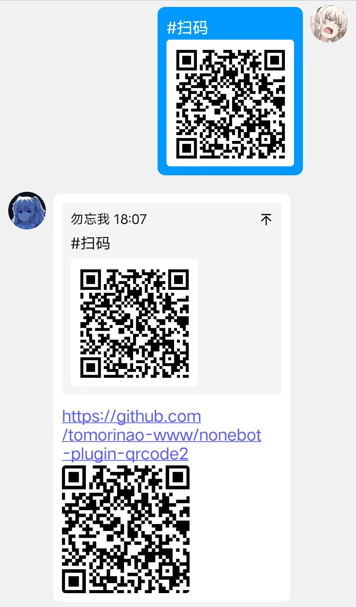
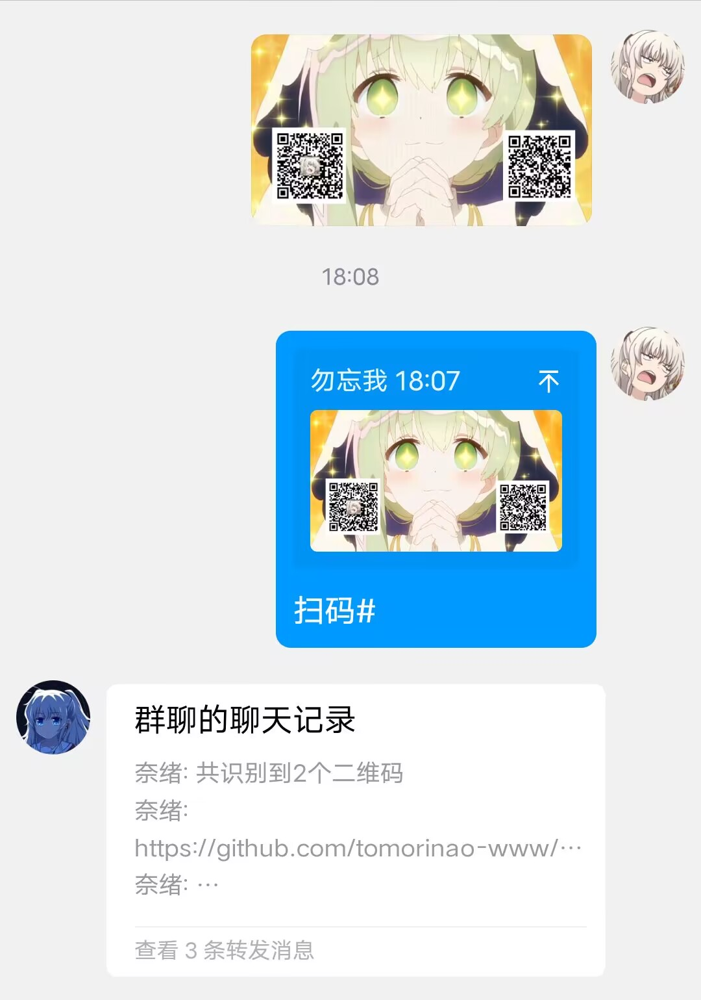
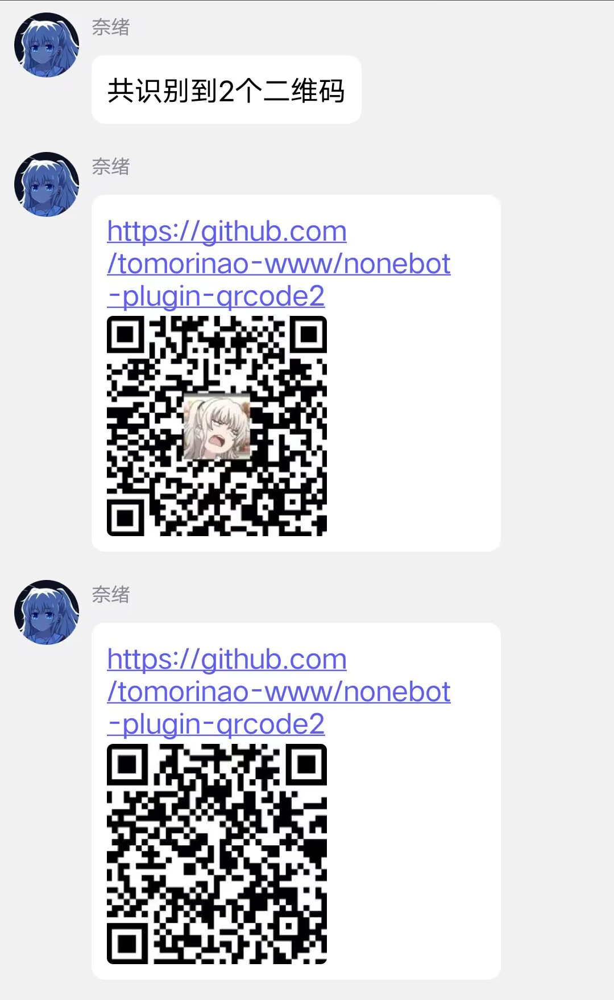

  
   
  

# nonebot-plugin-qrcode2

_✨ 通过pyzbar解析二维码 ✨_

## 💿 安装

使用 nb-cli 安装

在 nonebot2 项目的根目录下打开命令行, 输入以下指令即可安装

    nb plugin install nonebot-plugin-qrcode2

使用包管理器安装

在 nonebot2 项目的插件目录下, 打开命令行, 根据你使用的包管理器, 输入相应的安装命令

    pip install nonebot-plugin-qrcode2
    

打开 nonebot2 项目根目录下的 `pyproject.toml` 文件, 在 `[tool.nonebot]` 部分追加写入

    plugins = ["nonebot-plugin-qrcode2"]

## 🎉 使用

默认配置下

命令: {#} {扫码}

说明：命令符不是命令头，只要包含命令符和命令关键字就会触发响应，例如“foo扫码foo # foo”也可以触发

附带一张图片、或回复一张图片、或再发送一张图片

可以自定义命令符、命令关键字

示例:

  

## ⚙️ 配置

如果需要自定义配置，请在 nonebot2 项目的`.env`文件中添加配置

| 配置项                 | 必填 | 默认值                 | 说明 |
|:----------------------:|:---:|:----------------------:|:----:|
| animetrace_cmd         | 否 | "#"                     | 命令符 |
| animetrace_keyword     | 否 | ["扫码"] | 命令关键字 |
| animetrace_priority    | 否 | 10                      | 响应优先级 |
| nickname               | 否 | ["anime trace"]         | bot昵称列表，只取nickname[0] |
